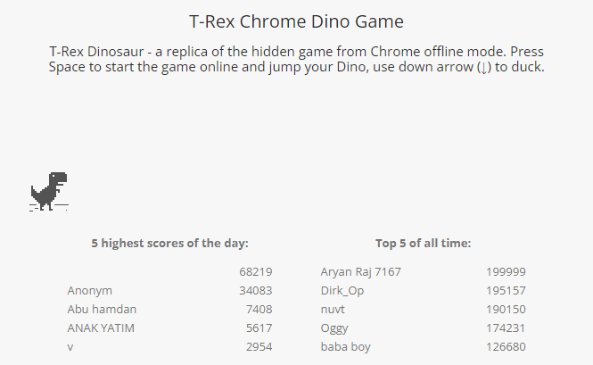

# Play Dino Game using micro:bit Board
Source code for playing [T-Rex Dino Game](https://chromedino.com/) using micro:bit board.

<picture>
  
</picture>

#### How to use this code:
1. Download this code [`microbit-dino.hex`](/microbit-dino.hex) (a [MakeCode](https://makecode.microbit.org/) file) on your micro:bit.
2. Run uploaded Python script [`src.py`](/src.py) on your computer.
3. Open [T-Rex Dino Game](https://chromedino.com/) and have fun.

Watch the implementation of this code on our YouTube channel:
https://www.youtube.com/@Roboticxps

To get your own micro:bit, visit our online store:
https://roboticx.ps/

Follow us on social media:

* Facebook:https://www.facebook.com/Roboticxps
* Instagram: https://www.instagram.com/roboticx.ps/
